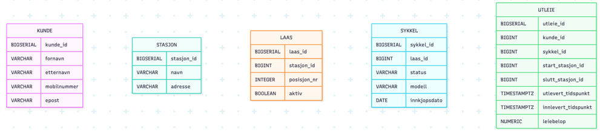
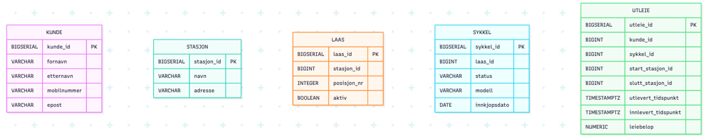
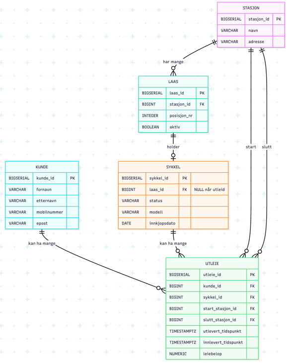

# Besvarelse - Refleksjon og Analyse

**Student:** Marius Lysenstøen

**Studentnummer:** malys3373

**Dato:** 1. mars 2026

---

## Del 1: Datamodellering

### Oppgave 1.1: Entiteter og attributter

**Identifiserte entiteter:**

Kunde, Stasjon, Sykkel, Lås, Utleie

**Attributter for hver entitet:**

```
- Kunde: kunde_id, fornavn, etternavn, mobilnummer, epost 
- Stasjon: stasjon_id, navn, adresse
- Sykkel: sykkel_id, laas_id, status, modell, innkjopsdato
- Lås: laas_id, stasjon_id, posisjon_nr, aktiv
- Utleie: utleie_id, kunde_id, sykkel_id, start_stasjon_id, slutt_stasjon_id, utlevert_tidspunkt, innlevert_tidspunkt, leiebelop
``` 
- Start- og sluttstasjon lagres i Utleie for å bevare historisk informasjon om hvor utleien startet og avsluttet. Dette kan ikke utledes fra sykkelens nåværende plassering, og lagres derfor eksplisitt.
---

### Oppgave 1.2: Datatyper og `CHECK`-constraints

**Valgte datatyper og begrunnelser:**

- Kunde: 
  - kunde_id: **SERIAL** - Denne får en surrogatnøkkel, fordi det er stabilt og effektivt i relasjoner. 
  - fornavn: **varchar(50)** - Dette er et kort tekstfelt, med en begrenset lengde.
  - etternavn: **varchar(50)** - Samme begrunnelse som fornavn. 
  - mobilnummer: **varchar(15)** - Siden telefonnummere kan inneholde landskoder, f.eks. "+47", og ledende nuller. 
  - epost: **varchar(254)** - Dette er maks lengde for epost i praksis (RFC) og er vanlig i databaser.
  
- Stasjon:
  - stasjon_id: **SERIAL** - Surrogatnøkkelen.
  - navn: **varchar(100)** - Navn på stasjonen, grei lengde. 
  - adresse: **varchar(200)** - Adressen eller området som tekst, grei lengde.

- Lås:
  - laas_id: **SERIAL** - Surrogatnøkkel
  - stasjon_id: **BIGINT** - Denne blir en FK til stasjon.
  - posisjon_nr: **INTEGER** - Plass eller nummer på låsen på stasjonen.
  - aktiv: **BOOLEAN** - Om låsen er i drift eller ikke (True eller false).

- Sykkel:
  - sykkel_id: **SERIAL** - Surrogatnøkkel.
  - laas_id: **BIGINT** - FK til lås når sykkelen er låst (NULL når den er utleid).
  - status: **varchar(20)** - For en enkel status, som "tilgjengelig", "utleid", osv..
  - modell: **varchar(100)** - Modellnavn fra datasettet.
  - innkjopsdato: **DATE** - Dato sykkelen ble kjøpt.

- Utleie:
  - utleie_id: **SERIAL** - Surrogatnøkkel.
  - kunde_id: **BIGINT** - Blir FK til kunde.
  - sykkel_id: **BIGINT** - Blir FK til sykkel.
  - start_stasjon_id: **BIGINT** - FK til startstasjon.
  - slutt_stasjon_id: **BIGINT** - FK til sluttstasjon.
  - utlevert_tidspunkt: **TIMESTAMPTZ** - Dette blir et tidsstempel med tidssone.
  - innlevert_tidspunkt: **TIMESTAMPTZ** - NULL når sykkelen ikke er levert ennå.
  - leiebelop: **NUMERIC(10,2)** - For penger med 2 desimaler. Dette unngår avrundingsfeil.

**`CHECK`-constraints:**

```
Kunde:
  - CHECK (mobilnummer ~ '^\+?[0-9]{8,15}$') - Det må se ut som et mobilnummer (tillater + og 8-15 siffer), og skal sikre at ikke bokstaver blir lagret.
  - CHECK (epost ~* '^[A-Z0-9._%+-]+@[A-Z0-9.-]+\.[A-Z]{2,}$') - Skal passe på at mail er i henhold til et bestemt format.
  - CHECK (length(trim(fornavn)) > 0) - Sjekker at fornavn ikke står tom.
  - CHECK (length(trim(etternavn)) > 0) - - Sjekker at etternavn ikke står tom.
```

```
Lås:
  - CHECK (posisjon_nr > 0) - Posisjon må være positiv
  
```

```
Sykkel:
  - CHECK (status IN ('tilgjengelig','utleid','service')) - Sjekker status
```

```
Utleie:
  - CHECK (innlevert_tidspunkt IS NULL OR innlevert_tidspunkt > utlevert_tidspunkt) - Innlevering etter utleie.
  - CHECK (leiebelop IS NULL OR leiebelop >= 0) - Leiebeløpet kan ikke være negativt.
```


**ER-diagram:**
- Er-diagram-oppsett med entiteter og attributter med datatyper:
  

---

### Oppgave 1.3: Primærnøkler

**Valgte primærnøkler og begrunnelser:**

- Kunde:
  - Primærnøkkel: ``kunde_id``
  - Begrunnelse: Telefonnummer og epost kunne blitt brukt som naturlige nøkler, men det kan være uheldig ettersom at de kan endres over tid. Derfor velger vi en stabil surrogatnøkkel.

- Stasjon:
  - Primærnøkkel: ``stasjon_id``
  - Begrunnelse: Navn eller adresse er ikke garantert unike og de kan endres. Derfor er en generert ID sikret for en entydig identifikasjon.

- Lås:
  - Primærnøkkel: ``laas_id``
  - Begrunnelse: Hver lås må identifiseres individuelt siden sykler kobles til en spesifikk lås. ``posisjon_nr`` er kun unikt for en spesiell stasjon og kan derfor ikke brukes alene.

- Sykkel:
  - Primærnøkkel: ``sykkel_id``
  - Begrunnelse: Denne casen spesifiserer at hver sykkel har en unik ID, som naturlig brukes som primærnøkkel.
  
- Utleie:
  - Primærnøkkel: ``utleie_id``
  - Begrunnelse: En kunde kan leie samme sykkel flere ganger. Derfor må hver utleiehendele ha en egen unik identifikator.

**Naturlige vs. surrogatnøkler:**

- I denne datamodellen er det hovedsaklig brukt **surrogatnøkler** som primærnøkler.
- Naturlige nøkler som telefonnummer, epost eller stasjonsnavn kunne i enkelte tilfeller blitt brukt, men disse kan endres eller være ikke-unike. Bruk av surrogatnøkler gir derfor:
  - stabile identifikatorer
  - enklere referanser via FKs
  - redusert risiko for oppdateringsproblemer
  - bedre dataintegritet

**Oppdatert ER-diagram:**

- Oppdetert ER-diagram med Primærnøkler:


---

### Oppgave 1.4: Forhold og fremmednøkler

**Identifiserte forhold og kardinalitet:**

1. Stasjon - Lås
   -  Kardinalitet: **en-til-mange (1:N)**
   - Èn stasjon har mange låser, og hver lås tilhører næyaktig èn stasjon.
2. Lås - Sykkel
   - Kardinalitet: **en-til-null-eller-en (1:0..1)**
   - En lås kam ha maks 1 sykkel parkert i seg om gangen.
   - En sykkel er enten parkert i en lås, eller utleid.
3. Kunde - Utleie
   - Kardinalitet: **en-til-mange (1:N)**
   - En kunde kan ha mange utleiere, men hver utleie tilhører nøyaktig èn kunde.
4. Sykkel - Utleie
   - Kardinalitet: **en-til-mange (1:N)**
   - En sykkel kan inngå i mange utleier over tid, men hver utleie gjelder nøyaktig èn sykkel.
5. Stasjon - Utleie (start)
    - Kardinalitet: **en-til-mange (1:N)**
    - En stasjon kan være startpunkt for mange utleier.
6. Stasjon - Utleie (slutt)
    - Kardinalitet: **en-til-mange (1:N)**
    - En stasjon kan være sluttpunkt for mange utleier.
- **mange-til-mange (M:N)**: Kunde - Sykkel
   - En kunde kan leie mange sykler over tid, og en sykkel kan leies av mange kunder over tid. 
   - Dette er et **mange-til-mange-forhold**, og det løses opp ved hjelp av den assosiative entiteten **Utleie**, som kobler sammen kunde og sykkel og lagrer tidsintervall og leiebeløp.


**Fremmednøkler:**

Fremmednøkler brukes for å mplementere forholdene over:
1. ``LAAS.stasjon_id`` --> ``STASJON.stasjon_id``
   - Implementerer forholdet **Stasjon (1) - (N) Lås**
2. ``SYKKEL.laas_id`` --> ``LAAS.laas_id`` (kan være NULL)
   - Implementerer forholdet mellom Lås og sykkel.
   - ``NULL`` betyr at sykkelen er utleid og dermed ikke står i noen lås eller stasjon.
3. ``UTLEIE.kunde_id``--> ``KUNDE.kunde_id``
   - Implementerer forholdet **Kunde (1) - (N) Utleie**.
4. ``UTLEIE.sykkel_id`` --> ``SYKKEL.sykkel_id``
   - Implementerer forholdet **Sykkel(1) - (N) Utleie**.
5. ``UTLEIE.start_stasjon_id`` --> **STASJON.stasjon_id**
6. ``UTLEIE.slutt_stasjon_id`` --> **STASJON.stasjon_id**


**Oppdatert ER-diagram:**

- Oppdatert ER-diagram med FKs og relasjoner:

---

### Oppgave 1.5: Normalisering

**Vurdering av 1. normalform (1NF):**

- Datamodellen tilfredstiller **første normalform (1NF)** fordi alle tabeller inneholder atomiske attributter. Det betyr at hvert felt kun inneholder èn verdi, og at det ikke finnes repeterende grupper eller verdifelt.
- For eksempel lagres kundens informasjon som separate attributter (``fornavn``, ``etternavn``, ``mobilnummer``, ``epost``) og ikke som sammensatte verdier. Tilsvarende lagres informasjon som sykler, låser og utleier i egne kolonner uten gjentakende attributter. 
- Alle entiteter har også definert primærnøkler som identifiserer hver rad som entydig.

**Vurdering av 2. normalform (2NF):**

- Datamodellen tilfredstiller **andre normalform (2NF)** fordi alle ikke-nøkkelattributter er fullt funksjonelt avhengig av hele primærnøkkelen.
- Alle tabeller bruker èn enkelt attributt som primærnøkkel (``kunde_id``, ``sykkel_id``, ``utleie_id``, osv..), og det finnes derfor ingen delvise avhengigheter.
- Eksempelvis er attributtene i **Utleie** (``utlevert_tidspunkt``, ``leiebelop``) avhengige av hele primærnøkkelen ``utleie_id``, og ikke av deler av en sammensatt nøkkel.

**Vurdering av 3. normalform (3NF):**

- Datamodellen tilfredstiller **tredje normalform (3NF)** fordi det ikke finnes transitive avhengigheter mellom ikke-nøkkelattributter.
- Informasjon som beskriver ulike konsepter er delt opp i egne entiteter:
  - Stasjonsinformasjonen lagres i **Stasjon**.
  - Låseinformasjon lagres i **Lås**.
  - Kundeinformasjon lagres i **Kunde**.
  - Utleieinformasjon lagres i **Utleie**.
- Start- og sluttstasjon lagres som fremmednøkler i Utleie, noe som bevarer historikk uten å lagre stasjonsinformasjon som tekst. Dette reduserer redundans og hindrer oppdateringsanomalier.
- Selv om både start_stasjon_id og slutt_stasjon_id refererer til samme entitet (Stasjon),
  representerer de ulike roller i utleieprosessen. Dette skaper derfor ikke
  transitive avhengigheter, men beskriver to separate relasjoner til samme entitet.


**Eventuelle justeringer:**

- Datamodellen tilfredstiller allerede kravene til **3NF**, så det trengs ikke å gjøre ytterlige justeringer.
---

## Del 2: Database-implementering

### Oppgave 2.1: SQL-skript for database-initialisering

**Plassering av SQL-skript:**

[Bekreft at du har lagt SQL-skriptet i `init-scripts/01-init-database.sql`]

- Jeg bekrefter at SQL-skriptet er laget.

**Antall testdata:**

- Kunder: 5
- Sykler: 100
- Sykkelstasjoner: 5
- Låser: 100
- Utleier: 50

---

### Oppgave 2.2: Kjøre initialiseringsskriptet

**Dokumentasjon av vellykket kjøring:**

[Skriv ditt svar her - f.eks. skjermbilder eller output fra terminalen som viser at databasen ble opprettet uten feil]

**Spørring mot systemkatalogen:**

```sql
SELECT table_name 
FROM information_schema.tables 
WHERE table_schema = 'public' 
  AND table_type = 'BASE TABLE'
ORDER BY table_name;
```

**Resultat:**

```
[Skriv resultatet av spørringen her - list opp alle tabellene som ble opprettet]
```

---

## Del 3: Tilgangskontroll

### Oppgave 3.1: Roller og brukere

**SQL for å opprette rolle:**

```sql
[Skriv din SQL-kode for å opprette rollen 'kunde' her]
```

**SQL for å opprette bruker:**

```sql
[Skriv din SQL-kode for å opprette brukeren 'kunde_1' her]
```

**SQL for å tildele rettigheter:**

```sql
[Skriv din SQL-kode for å tildele rettigheter til rollen her]
```

---

### Oppgave 3.2: Begrenset visning for kunder

**SQL for VIEW:**

```sql
[Skriv din SQL-kode for VIEW her]
```

**Ulempe med VIEW vs. POLICIES:**

[Skriv ditt svar her - diskuter minst én ulempe med å bruke VIEW for autorisasjon sammenlignet med POLICIES]

---

## Del 4: Analyse og Refleksjon

### Oppgave 4.1: Lagringskapasitet

**Gitte tall for utleierate:**

- Høysesong (mai-september): 20000 utleier/måned
- Mellomsesong (mars, april, oktober, november): 5000 utleier/måned
- Lavsesong (desember-februar): 500 utleier/måned

**Totalt antall utleier per år:**

[Skriv din utregning her]

**Estimat for lagringskapasitet:**

[Skriv din utregning her - vis hvordan du har beregnet lagringskapasiteten for hver tabell]

**Totalt for første år:**

[Skriv ditt estimat her]

---

### Oppgave 4.2: Flat fil vs. relasjonsdatabase

**Analyse av CSV-filen (`data/utleier.csv`):**

**Problem 1: Redundans**

[Skriv ditt svar her - gi konkrete eksempler fra CSV-filen som viser redundans]

**Problem 2: Inkonsistens**

[Skriv ditt svar her - forklar hvordan redundans kan føre til inkonsistens med eksempler]

**Problem 3: Oppdateringsanomalier**

[Skriv ditt svar her - diskuter slette-, innsettings- og oppdateringsanomalier]

**Fordeler med en indeks:**

[Skriv ditt svar her - forklar hvorfor en indeks ville gjort spørringen mer effektiv]

**Case 1: Indeks passer i RAM**

[Skriv ditt svar her - forklar hvordan indeksen fungerer når den passer i minnet]

**Case 2: Indeks passer ikke i RAM**

[Skriv ditt svar her - forklar hvordan flettesortering kan brukes]

**Datastrukturer i DBMS:**

[Skriv ditt svar her - diskuter B+-tre og hash-indekser]

---

### Oppgave 4.3: Datastrukturer for logging

**Foreslått datastruktur:**

[Skriv ditt svar her - f.eks. heap-fil, LSM-tree, eller annen egnet datastruktur]

**Begrunnelse:**

**Skrive-operasjoner:**

[Skriv ditt svar her - forklar hvorfor datastrukturen er egnet for mange skrive-operasjoner]

**Lese-operasjoner:**

[Skriv ditt svar her - forklar hvordan datastrukturen håndterer sjeldne lese-operasjoner]

---

### Oppgave 4.4: Validering i flerlags-systemer

**Hvor bør validering gjøres:**

[Skriv ditt svar her - argumenter for validering i ett eller flere lag]

**Validering i nettleseren:**

[Skriv ditt svar her - diskuter fordeler og ulemper]

**Validering i applikasjonslaget:**

[Skriv ditt svar her - diskuter fordeler og ulemper]

**Validering i databasen:**

[Skriv ditt svar her - diskuter fordeler og ulemper]

**Konklusjon:**

[Skriv ditt svar her - oppsummer hvor validering bør gjøres og hvorfor]

---

### Oppgave 4.5: Refleksjon over læringsutbytte

**Hva har du lært så langt i emnet:**

[Skriv din refleksjon her - diskuter sentrale konsepter du har lært]

**Hvordan har denne oppgaven bidratt til å oppnå læringsmålene:**

[Skriv din refleksjon her - koble oppgaven til læringsmålene i emnet]

Se oversikt over læringsmålene i en PDF-fil i Canvas https://oslomet.instructure.com/courses/33293/files/folder/Plan%20v%C3%A5ren%202026?preview=4370886

**Hva var mest utfordrende:**

[Skriv din refleksjon her - diskuter hvilke deler av oppgaven som var mest krevende]

**Hva har du lært om databasedesign:**

[Skriv din refleksjon her - reflekter over prosessen med å designe en database fra bunnen av]

---

## Del 5: SQL-spørringer og Automatisk Testing

**Plassering av SQL-spørringer:**

[Bekreft at du har lagt SQL-spørringene i `test-scripts/queries.sql`]


**Eventuelle feil og rettelser:**

[Skriv ditt svar her - hvis noen tester feilet, forklar hva som var feil og hvordan du rettet det]

---

## Del 6: Bonusoppgaver (Valgfri)

### Oppgave 6.1: Trigger for lagerbeholdning

**SQL for trigger:**

```sql
[Skriv din SQL-kode for trigger her, hvis du har løst denne oppgaven]
```

**Forklaring:**

[Skriv ditt svar her - forklar hvordan triggeren fungerer]

**Testing:**

[Skriv ditt svar her - vis hvordan du har testet at triggeren fungerer som forventet]

---

### Oppgave 6.2: Presentasjon

**Lenke til presentasjon:**

[Legg inn lenke til video eller presentasjonsfiler her, hvis du har løst denne oppgaven]

**Hovedpunkter i presentasjonen:**

[Skriv ditt svar her - oppsummer de viktigste punktene du dekket i presentasjonen]

---

**Slutt på besvarelse**
